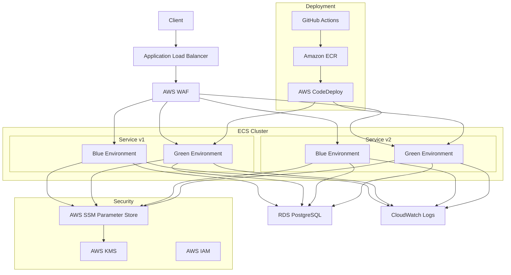

# Architecture Documentation

This document provides a comprehensive overview of the FastAPI Bootstrap project's architecture, designed for Solutions Architects, DevOps Engineers, and Software Engineers.

## System Architecture Overview

## Architecture Diagram



## Key Components

### API Layer

Two options are available for the API layer:

1. **Application Load Balancer (ALB)** - Default option
   - HTTP/HTTPS routing with path-based routing for API versions
   - SSL termination and integration with AWS WAF
   - Health checks and automatic traffic redistribution
   - Supports blue/green deployments with production/test listeners

2. **API Gateway** - Optional alternative
   - HTTP API with VPC Link to ALB
   - Additional features: throttling, API keys, custom domains
   - Direct integration with AWS WAF
   - Recommended for APIs requiring fine-grained access control

### Compute Layer

- **ECS Fargate**
  - Serverless container orchestration eliminating the need to manage servers
  - Automatic scaling based on CPU utilization
  - Blue/Green deployment with CodeDeploy for zero-downtime updates
  - X-Ray tracing integration for distributed tracing
  - IAM roles for task execution and task operation

### Database Layer

- **RDS PostgreSQL**
  - Managed relational database service
  - Encrypted storage with KMS for data-at-rest protection
  - Automated backups and point-in-time recovery
  - Multi-AZ option for production environments
  - Connection pooling with PgBouncer for efficient resource utilization

### Security Layer

- **VPC**
  - Public and private subnets across multiple Availability Zones
  - Security groups for network traffic isolation
  - NAT Gateway for outbound traffic from private subnets
  - VPC Endpoints for secure AWS service access

- **WAF**
  - Protection against OWASP Top 10 web vulnerabilities
  - Rate limiting to prevent DDoS attacks
  - AWS managed rule sets and custom rules
  - Geographic restrictions when needed

- **Identity and Access Management**
  - Least privilege IAM roles for ECS tasks
  - Service-linked roles for AWS services
  - Resource-based policies for S3, KMS, etc.
  - Secrets management with SSM Parameter Store

### Monitoring and Observability

- **CloudWatch**
  - Centralized logging with structured JSON logs
  - Custom metrics for application performance
  - Alarms for critical system states
  - Dashboards for system overview

- **X-Ray**
  - Distributed tracing across services
  - Performance bottleneck identification
  - Error tracking and service map visualization

## API Versioning

The API is versioned using URL path-based versioning:

- `/api/v1/` - First version of the API
- `/api/v2/` - Second version of the API (when needed)

This approach allows for:
- Clean separation between API versions
- Independent deployment of each version
- Easy routing at the load balancer level
- Clear client integration paths
## Code Structure

The application code follows a clean architecture pattern:

1. **API Layer** (`src/fastapi_bootstrap/api/`)
   - Route definitions and endpoint handlers
   - Request validation with Pydantic models
   - Version-specific business logic

2. **Service Layer** (`src/fastapi_bootstrap/services/`)
   - Business logic implementation
   - Integration with external services
   - Transaction management

3. **Data Access Layer** (`src/fastapi_bootstrap/db/`)
   - Database models and schemas
   - Query construction and execution
   - Connection management

4. **Utility Layer** (`src/fastapi_bootstrap/utils/`)
   - Cross-cutting concerns
   - Middleware implementations
   - Telemetry and logging utilities

## Environment Configuration

The application uses a hierarchical configuration approach:

1. **Base Configuration**: Default values suitable for most environments
2. **Environment-Specific Configuration**: Values that differ between environments (dev/test/prod)
3. **Secret Configuration**: Sensitive values stored in SSM Parameter Store
4. **Runtime Configuration**: Values that can be changed without redeployment

This configuration is applied at different levels:
- Terraform variables for infrastructure
- Environment variables for containers
- SSM parameters for secrets

## Next Steps

For further details on specific components:

- See [Infrastructure Documentation](infrastructure.md) for AWS resource details
- See [Security Documentation](security.md) for security implementation details
- See [Local Development Guide](local-development.md) for development setup
- See [Deployment Guide](deployment-guide.md) for deployment procedures
│                                                               │
└───────────────────────────────────────────────────────────────┘
```

### Deployment Architecture

```
┌─────────────────┐     ┌─────────────────┐     ┌─────────────────┐
│                 │     │                 │     │                 │
│  GitHub         │     │  AWS CodeDeploy │     │  ECS Blue/Green │
│  Actions        ├────►│                 ├────►│  Deployment     │
│                 │     │                 │     │                 │
└────────┬────────┘     └─────────────────┘     └────────┬────────┘
         │                                               │
         │                                               │
         ▼                                               ▼
┌─────────────────┐                           ┌─────────────────┐
│                 │                           │                 │
│  ECR            │                           │  CloudWatch     │
│  Repository     │                           │  Logs           │
│                 │                           │                 │
└─────────────────┘                           └─────────────────┘
```

## Component Details

### FastAPI Application

The FastAPI application is structured with the following components:

- **API Versioning**: `/api/v1`, `/api/v2`, etc.
- **Health Checks**: `/health` and `/ready` endpoints
- **X-Ray Tracing**: Distributed tracing for performance monitoring
- **Structured Logging**: JSON-formatted logs with context
- **Configuration Management**: SSM Parameter Store integration

### Database

The database layer provides:

- **Connection Management**: Connection pooling and retry logic
- **Migration Support**: Alembic integration for schema migrations
- **Secure Credentials**: SSM Parameter Store for database credentials
- **Encryption**: Data encryption at rest and in transit

### CI/CD Pipeline

The CI/CD pipeline includes:

- **Automated Testing**: Unit and integration tests
- **Security Scanning**: Vulnerability scanning with Trivy
- **Infrastructure Validation**: Terraform validation and security scanning
- **Blue/Green Deployment**: Zero-downtime deployments
- **Post-Deployment Testing**: Automated tests against deployed environment

## Scaling Strategy

The application scales in the following ways:

- **Horizontal Scaling**: Auto-scaling based on CPU utilization
- **Database Scaling**: RDS instance sizing based on environment
- **Cost Optimization**: Right-sized resources for each environment

## Security Considerations

Security is implemented at multiple layers:

- **Network**: VPC isolation, security groups, WAF
- **Application**: Input validation, secure coding practices
- **Data**: Encryption at rest and in transit
- **Authentication**: IAM roles and policies
- **Monitoring**: Security event logging and alerting

## Future Architecture Considerations

Potential future enhancements include:

1. **Serverless API Option**: AWS Lambda with API Gateway
2. **Multi-Region Deployment**: Global distribution for high availability
3. **Event-Driven Architecture**: Integration with EventBridge
4. **Caching Layer**: ElastiCache or CloudFront for improved performance
5. **Container Insights**: Enhanced container monitoring