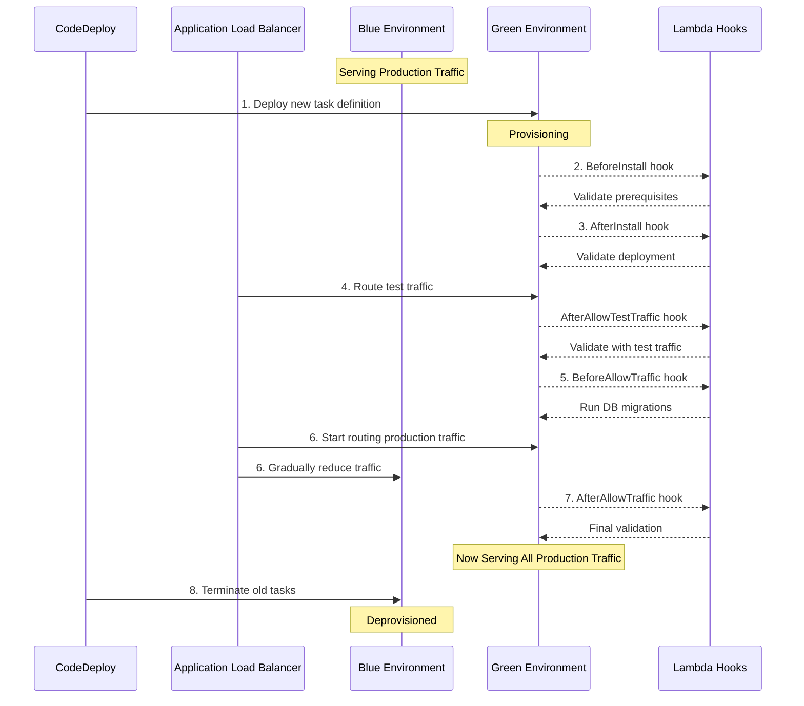

# Blue/Green Deployment Strategy

This document provides a comprehensive explanation of the blue/green deployment strategy implemented in the FastAPI Bootstrap project for AWS ECS services. It is designed for Solutions Architects, DevOps Engineers, and Software Engineers who need to understand, implement, or troubleshoot the deployment process.

## Overview

Blue/green deployment is a deployment technique that reduces downtime and risk by running two identical production environments:

- **Blue Environment**: The currently active production environment serving live traffic
- **Green Environment**: The new environment with the updated application version

At any time, only one environment is serving all production traffic. This approach allows for:

1. **Zero-downtime deployments**: Traffic is only switched when the new environment is fully operational
2. **Instant rollback capability**: If issues are detected, traffic can be routed back to the original environment
3. **Testing in production-like conditions**: The new environment can be tested with production-like configurations before serving real traffic
4. **Reduced deployment risk**: The deployment process can be aborted at any stage without affecting production traffic

## How It Works in FastAPI Bootstrap



## Implementation Details

### AWS Services Involved

The blue/green deployment infrastructure in FastAPI Bootstrap leverages several AWS services:

1. **AWS CodeDeploy**: Orchestrates the entire deployment process
2. **Amazon ECS**: Manages the containerized application tasks
3. **Application Load Balancer**: Routes traffic between blue and green environments
4. **AWS Lambda**: Runs validation hooks at various stages of deployment
5. **CloudWatch Logs**: Captures logs from deployment process
6. **IAM**: Provides permissions for all services to interact

### AppSpec Files

The AppSpec files (`.aws/appspec-v1-*.yaml`) define how CodeDeploy should handle the deployment. These files are crucial for the blue/green deployment process:

```yaml
version: 0.0
Resources:
  - TargetService:
      Type: AWS::ECS::Service
      Properties:
        TaskDefinition: "arn:aws:ecs:region:account:task-definition/taskdef-family:revision"
        LoadBalancerInfo:
          ContainerName: "fastapi-bootstrap"
          ContainerPort: 8000
        PlatformVersion: "LATEST"
        NetworkConfiguration:
          AwsvpcConfiguration:
            Subnets: ["subnet-abcdef12", "subnet-34567890"]
            SecurityGroups: ["sg-abcdef12"]
            AssignPublicIp: "DISABLED"
Hooks:
  - BeforeInstall: "arn:aws:lambda:region:account:function:validate-before-install"
  - AfterInstall: "arn:aws:lambda:region:account:function:validate-deployment"
  - AfterAllowTestTraffic: "arn:aws:lambda:region:account:function:validate-test-traffic"
  - BeforeAllowTraffic: "arn:aws:lambda:region:account:function:run-migrations"
  - AfterAllowTraffic: "arn:aws:lambda:region:account:function:validate-production"
```

Key components of the AppSpec file:

1. **TaskDefinition**: The ECS task definition to deploy
2. **LoadBalancerInfo**: Container and port information for the load balancer
3. **NetworkConfiguration**: Network settings for tasks using awsvpc network mode
4. **Hooks**: Lambda functions that run at different stages of deployment

### Deployment Hooks and Lambda Functions

The deployment process includes several Lambda functions that run at different stages to ensure a safe and reliable deployment:

| Hook | Lambda Function | Purpose |
|------|----------------|---------|
| **BeforeInstall** | `validate-before-install` | Validates prerequisites before deployment starts |
| **AfterInstall** | `validate-deployment` | Confirms the new task set is deployed successfully |
| **AfterAllowTestTraffic** | `validate-test-traffic` | Tests the application with synthetic traffic |
| **BeforeAllowTraffic** | `run-migrations` | Executes database migrations before production traffic |
| **AfterAllowTraffic** | `validate-production` | Final validation after production traffic is routed |

The Lambda functions are created by the `generate-lambda-functions.sh` script during deployment:

```bash
#!/bin/bash
# Generate Lambda functions for deployment hooks

SCRIPT_DIR="$(cd "$(dirname "${BASH_SOURCE[0]}")" && pwd)"
PROJECT_ROOT="$(dirname "$SCRIPT_DIR")"
OUTPUT_DIR="${PROJECT_ROOT}/terraform/modules/lambda/lambda_functions"

# Create output directory if it doesn't exist
mkdir -p ${OUTPUT_DIR}

# Generate validate-before-install function
cat > /tmp/validate-before-install.py << EOF
import json
import boto3
import os

def lambda_handler(event, context):
    print("Validating prerequisites before deployment...")

    # Get deployment details
    deployment_id = event['deploymentId']
    lifecycle_event_hook_execution_id = event['lifecycleEventHookExecutionId']

    # Perform validation logic here
    # For example, check if database is available

    # Complete the lifecycle event
    codedeploy = boto3.client('codedeploy')
    codedeploy.put_lifecycle_event_hook_execution_status(
        deploymentId=deployment_id,
        lifecycleEventHookExecutionId=lifecycle_event_hook_execution_id,
        status='Succeeded'
    )

    return {
        'statusCode': 200,
        'body': json.dumps('Validation before install succeeded')
    }
EOF

cd /tmp
zip -r validate-before-install.zip validate-before-install.py
mv validate-before-install.zip ${OUTPUT_DIR}/

# Generate other Lambda functions similarly...
```

## Traffic Shifting Configuration

The blue/green deployment in FastAPI Bootstrap uses a controlled traffic shifting approach to minimize risk:

1. **Canary**: Initially, only 10% of traffic is routed to the green environment
2. **Linear**: Traffic is then gradually increased in 10% increments every 5 minutes
3. **All-at-once**: For dev environments, traffic can be shifted all at once for faster deployments

## Considerations for ECS Blue/Green Deployments

1. **Network Configuration**: Must be specified in the AppSpec file for tasks using awsvpc network mode
2. **Task Definition Immutability**: Task definitions are immutable; each deployment creates a new revision
3. **Container Health Checks**: Configured with appropriate intervals and timeouts
4. **Deployment Tracking**: Using environment variables to track deployment IDs
5. **Rollback Strategy**: Automatic rollback on deployment failures

## Health Checks

The FastAPI application implements two critical health check endpoints that are essential for the blue/green deployment process:

### 1. Basic Health Check (`/health`)

This endpoint provides a simple check that the application is running:

```python
@app.get("/health", tags=["health"])
async def health_check():
    """
    Basic health check endpoint.
    Returns 200 OK if the application is running.
    """
    return {"status": "healthy", "version": __version__}
```

### 2. Readiness Check (`/ready`)

This more comprehensive endpoint is used during deployment to verify the application is fully ready to receive traffic:

```python
@app.get("/ready", tags=["health"])
async def readiness_check():
    """
    Readiness check endpoint.
    Verifies that the application can connect to all required services.
    """
    # Check database connection
    try:
        await db.execute("SELECT 1")
    except Exception as e:
        logger.error(f"Database connection failed: {str(e)}")
        return JSONResponse(
            status_code=503,
            content={"status": "not ready", "reason": "Database connection failed"}
        )

    # Check cache connection
    # Check external services
    # Other dependency checks...

    return {"status": "ready", "version": __version__}
```

The ALB is configured to use these endpoints for health checks:

- **Target Group Health Check Settings**:
  - Path: `/ready`
  - Protocol: HTTP
  - Port: Traffic port
  - Healthy threshold: 2
  - Unhealthy threshold: 3
  - Timeout: 5 seconds
  - Interval: 30 seconds

## Troubleshooting Blue/Green Deployments

### Common Issues and Solutions

| Issue | Possible Causes | Solution |
|-------|----------------|----------|
| Deployment Timeout | Health checks failing | Check CloudWatch Logs for container startup issues |
| Lambda Hook Failure | Permission issues or code error | Check Lambda function logs in CloudWatch |
| Traffic Not Shifting | Target group deregistration delay | Adjust deregistration delay settings |
| Rollback Occurring | Application errors in green environment | Check application logs for errors |
| Deployment Stuck | CodeDeploy service issues | Check AWS Service Health Dashboard |

### Debugging Tools

1. **AWS Console**:
   - CodeDeploy deployment history
   - ECS service events
   - CloudWatch Logs for containers and Lambda functions

2. **AWS CLI Commands**:
   ```bash
   # Get deployment status
   aws deploy get-deployment --deployment-id <deployment-id>

   # List deployments for the application
   aws deploy list-deployments --application-name fastapi-bootstrap-<env>

   # View ECS service events
   aws ecs describe-services --cluster fastapi-bootstrap-<env> --services fastapi-bootstrap-v1-<env>
   ```

3. **Deployment Rollback**:
   ```bash
   # Manually roll back a deployment
   aws deploy stop-deployment --deployment-id <deployment-id>
   ```

## References

- [AWS CloudFormation User Guide - Blue/Green Considerations](https://docs.aws.amazon.com/AWSCloudFormation/latest/UserGuide/blue-green-considerations.html)
- [AWS CodeDeploy User Guide - AppSpec File Reference](https://docs.aws.amazon.com/codedeploy/latest/userguide/reference-appspec-file.html)