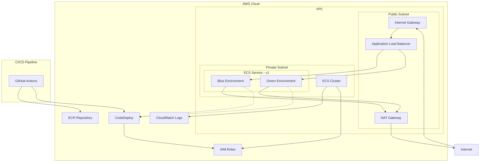

# Infrastructure Documentation

This document provides an overview of the infrastructure setup for the FastAPI Bootstrap project. The infrastructure is managed using Terraform and deployed to AWS.

## Overview

The FastAPI Bootstrap application is containerized and deployed to AWS Fargate within Amazon ECS (Elastic Container Service). The infrastructure follows a modern microservices architecture pattern with blue/green deployment capabilities through AWS CodeDeploy.

## Infrastructure Components

### AWS Services

| Service | Purpose |
|---------|---------|
| **ECS Fargate** | Serverless container orchestration service to run the FastAPI application |
| **ECR** | Container registry to store Docker images |
| **ALB** | Application Load Balancer to route traffic to the application |
| **VPC** | Virtual Private Cloud with public and private subnets |
| **CodeDeploy** | Manages blue/green deployments |
| **CloudWatch** | Monitoring and logging |
| **IAM** | Identity and Access Management for permissions |
| **S3** | Storage for Terraform state (backend) |
| **DynamoDB** | Terraform state locking |

## Infrastructure Diagram

## Key Infrastructure Files

### Terraform Configuration

#### Main Configuration Files

- **terraform/main.tf**: The main entry point for Terraform that defines provider configuration, backend settings, and includes all the modules.
  - Configures AWS provider and Terraform backend for state management
  - Sets up variables for environment, AWS region, and application name
  - Includes all infrastructure modules

#### Environment-specific Configurations

- **terraform/environments/dev/terraform.tfvars**: Development environment settings
  - Allocates minimal resources (CPU: 256, Memory: 512MB)
  - Single container instance (min/max capacity: 1)

- **terraform/environments/test/terraform.tfvars**: Test environment settings
  - Same resource allocation as dev environment
  - Single container instance

- **terraform/environments/prod/terraform.tfvars**: Production environment settings
  - Higher resource allocation (CPU: 1024, Memory: 2048MB)
  - Scalable from 1 to 2 instances

#### Infrastructure Modules

- **terraform/modules/vpc/main.tf**: Creates the VPC infrastructure
  - Sets up a VPC with CIDR block 10.0.0.0/16
  - Creates public and private subnets across 3 availability zones
  - Configures internet gateway, NAT gateway, and route tables

- **terraform/modules/security/main.tf**: Defines security groups
  - ALB security group allowing HTTP/HTTPS traffic from the internet
  - ECS security group allowing traffic from ALB on port 8000

- **terraform/modules/iam/main.tf**: Sets up IAM roles and policies
  - ECS Task Execution Role with permissions for ECR, CloudWatch, Secrets Manager
  - ECS Task Role with permissions to access other AWS services
  - Access to Secrets Manager and SSM Parameter Store for configuration

- **terraform/modules/ecr/main.tf**: Creates an Elastic Container Registry
  - Stores Docker images for the application
  - Implements lifecycle policy to keep only the latest 10 images

- **terraform/modules/ecs/main.tf**: Configures ECS service and task definitions
  - Creates ECS cluster and service
  - Sets up task definition for the FastAPI application
  - Configures application load balancer, target groups for blue/green deployment
  - Implements auto-scaling based on CPU utilization

- **terraform/modules/codedeploy/main.tf**: Sets up CodeDeploy for blue/green deployments
  - Creates CodeDeploy application and deployment group
  - Configures blue/green deployment settings
  - Sets up auto-rollback configuration

### AWS Configuration Files

- **.aws/task-definition-v1-*.json**: ECS task definition templates for different environments
  - Defines container configuration, resource allocation, and environment variables
  - Used by GitHub Actions to deploy updated container images

- **.aws/appspec-v1-*.yaml**: CodeDeploy AppSpec files for different environments
  - Defines deployment configuration for blue/green deployments
  - Specifies deployment hooks for validation and database migrations

### CI/CD Configuration

- **.github/workflows/deploy.yml**: GitHub Actions workflow for CI/CD
  - Runs tests on every push or pull request
  - Builds and pushes Docker images to ECR
  - Updates ECS task definitions and triggers deployments
  - Supports different environments based on branch (main → prod, develop → dev)

- **.github/workflows/code_quality.yml**: GitHub Actions workflow for code quality
  - Runs linting, spell checking, and unit tests
  - Ensures code quality before deployment

## Deployment Flow

1. **Code Push**: Developer pushes code to GitHub (develop branch for dev, main branch for prod)
2. **CI Pipeline**:
   - GitHub Actions runs tests
   - Builds Docker image and pushes to ECR
3. **CD Pipeline**:
   - Updates ECS task definition with new image
   - Initiates blue/green deployment via CodeDeploy
   - Runs pre and post-deployment validation
4. **Deployment**:
   - New version is deployed to the green environment
   - Traffic is gradually shifted from blue to green
   - Once validated, blue environment is terminated

## Environment-specific Configuration

The infrastructure supports three distinct environments:

1. **Development (dev)**: Used for ongoing development
   - Minimal resources
   - Triggered by pushes to the develop branch

2. **Test (test)**: Used for QA and testing
   - Similar to dev but isolated
   - Can be used for feature branch testing

3. **Production (prod)**: Live environment
   - Higher resource allocation
   - Auto-scaling enabled
   - Enhanced security measures
   - Deletion protection enabled
   - Triggered by pushes to the main branch

## Resource Scaling

- **Development/Test**: Fixed at 1 container (256 CPU units, 512MB memory)
- **Production**: Scales from 1 to 2 containers (1024 CPU units, 2048MB memory)
- Auto-scaling based on CPU utilization (target: 70%)