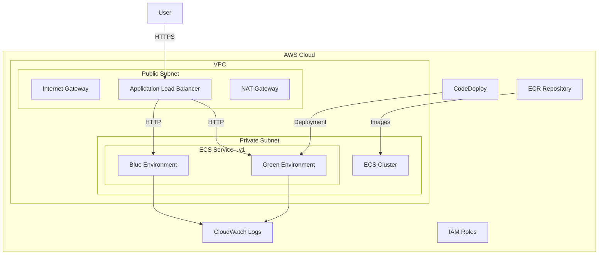

# Infrastructure Documentation

This document provides a comprehensive overview of the infrastructure architecture and configuration for the FastAPI Bootstrap project. It is designed for Solutions Architects, DevOps Engineers, and Software Engineers who need to understand, deploy, and maintain the AWS infrastructure.

## Overview

The FastAPI Bootstrap application is containerized and deployed to AWS Fargate within Amazon ECS (Elastic Container Service). The infrastructure follows a modern microservices architecture pattern with blue/green deployment capabilities through AWS CodeDeploy.

All infrastructure is defined as code using Terraform, enabling consistent, repeatable deployments across multiple environments (development, testing, production).

## Infrastructure Components

### AWS Services

| Service | Purpose |
|---------|---------|
| **ECS Fargate** | Serverless container orchestration service to run the FastAPI application without managing servers |
| **ECR** | Container registry to store Docker images with vulnerability scanning and immutable tags |
| **ALB** | Application Load Balancer to route traffic to the application, handle SSL termination, and support blue/green deployments |
| **VPC** | Virtual Private Cloud with public and private subnets across multiple Availability Zones for isolation and resilience |
| **CodeDeploy** | Manages blue/green deployments with automated rollback capabilities |
| **CloudWatch** | Comprehensive monitoring, logging, and alerting for all components |
| **IAM** | Identity and Access Management for fine-grained access control with least-privilege policies |
| **S3** | Storage for Terraform state (backend) and other application assets |
| **DynamoDB** | Terraform state locking to prevent concurrent modifications |
| **KMS** | Key Management Service for encryption of sensitive data |
| **SSM Parameter Store** | Secure storage for configuration and secrets |
| **Route 53** | Optional DNS management for custom domains |
| **WAF** | Web Application Firewall for protection against common vulnerabilities |

## Infrastructure Architecture



## Terraform Structure

The infrastructure is defined using a modular Terraform approach, organized as follows:

```
terraform/
├── main.tf              # Main Terraform configuration and provider setup
├── environments/        # Environment-specific configurations
│   ├── dev/
│   │   └── terraform.tfvars  # Development environment variables
│   ├── test/
│   │   └── terraform.tfvars  # Testing environment variables
│   └── prod/
│       └── terraform.tfvars  # Production environment variables
└── modules/             # Reusable Terraform modules
    ├── api_gateway/     # Optional API Gateway configuration
    ├── codedeploy/      # Blue/Green deployment configuration
    ├── database/        # RDS PostgreSQL configuration
    ├── ecr/             # Elastic Container Registry
    ├── ecs/             # ECS Fargate cluster and services
    ├── iam/             # IAM roles and policies
    ├── lambda/          # Lambda functions for deployment hooks
    ├── monitoring/      # CloudWatch dashboards and alarms
    ├── security/        # WAF and security groups
    ├── ssm/             # Systems Manager Parameter Store
    └── vpc/             # Virtual Private Cloud network configuration
```

### Main Terraform Configuration

The `main.tf` file serves as the entry point for Terraform and sets up:

1. **AWS Provider Configuration**: Region, version constraints
2. **Backend Configuration**: S3 bucket for state storage with DynamoDB locking
3. **Module Invocations**: Calling all required modules with appropriate variables
4. **Output Definitions**: Information about created resources

```hcl
provider "aws" {
  region = var.aws_region
}

terraform {
  required_version = ">= 1.0.0"

  required_providers {
    aws = {
      source  = "hashicorp/aws"
      version = "~> 5.0"
    }
  }

  backend "s3" {
    bucket         = "fastapi-bootstrap-terraform-state"
    key            = "fastapi-bootstrap/terraform.tfstate"
    region         = "us-east-1"
    dynamodb_table = "terraform-locks"
    encrypt        = true
  }
}

# Modules
module "vpc" {
  source      = "./modules/vpc"
  environment = var.environment
  app_name    = var.app_name
  # ... other variables
}

module "ecs" {
  source        = "./modules/ecs"
  environment   = var.environment
  app_name      = var.app_name
  vpc_id        = module.vpc.vpc_id
  subnet_ids    = module.vpc.private_subnet_ids
  # ... other variables
}

# ... other modules

# Outputs
output "api_url" {
  value = module.ecs.alb_dns_name
}
```

    subgraph "CI/CD Pipeline"
        GH[GitHub Actions]
    end

    Internet --> IGW
    IGW --> ALB
    ALB --> BLUE
    ALB --> GREEN
    NAT --> Internet

    BLUE --> NAT
    GREEN --> NAT

    ECS --> CW
    BLUE -.-> CD
    GREEN -.-> CD

    GH --> ECR
    GH --> CD

    ECS --> IAM
    CD --> IAM
```

## Key Infrastructure Files

### Terraform Configuration

#### Main Configuration Files

- **terraform/main.tf**: The main entry point for Terraform that defines provider configuration, backend settings, and includes all the modules.
  - Configures AWS provider and Terraform backend for state management
  - Sets up variables for environment, AWS region, and application name
  - Includes all infrastructure modules

#### Environment-specific Configurations

- **terraform/environments/dev/terraform.tfvars**: Development environment settings
  - Allocates minimal resources (CPU: 256, Memory: 512MB)
  - Single container instance (min/max capacity: 1)

- **terraform/environments/test/terraform.tfvars**: Test environment settings
  - Same resource allocation as dev environment
  - Single container instance

- **terraform/environments/prod/terraform.tfvars**: Production environment settings
  - Higher resource allocation (CPU: 1024, Memory: 2048MB)
  - Scalable from 1 to 2 instances

#### Infrastructure Modules

- **terraform/modules/vpc/main.tf**: Creates the VPC infrastructure
  - Sets up a VPC with CIDR block 10.0.0.0/16
  - Creates public and private subnets across 3 availability zones
  - Configures internet gateway, NAT gateway, and route tables

- **terraform/modules/security/main.tf**: Defines security groups
  - ALB security group allowing HTTP/HTTPS traffic from the internet
  - ECS security group allowing traffic from ALB on port 8000

- **terraform/modules/iam/main.tf**: Sets up IAM roles and policies
  - ECS Task Execution Role with permissions for ECR, CloudWatch, Secrets Manager
  - ECS Task Role with permissions to access other AWS services
  - Access to Secrets Manager and SSM Parameter Store for configuration

- **terraform/modules/ecr/main.tf**: Creates an Elastic Container Registry
  - Stores Docker images for the application
  - Implements lifecycle policy to keep only the latest 10 images

- **terraform/modules/ecs/main.tf**: Configures ECS service and task definitions
  - Creates ECS cluster and service
  - Sets up task definition for the FastAPI application
  - Configures application load balancer, target groups for blue/green deployment
  - Implements auto-scaling based on CPU utilization

- **terraform/modules/codedeploy/main.tf**: Sets up CodeDeploy for blue/green deployments
  - Creates CodeDeploy application and deployment group
  - Configures blue/green deployment settings
  - Sets up auto-rollback configuration

### AWS Configuration Files

- **.aws/task-definition-v1-*.json**: ECS task definition templates for different environments
  - Defines container configuration, resource allocation, and environment variables
  - Used by GitHub Actions to deploy updated container images

- **.aws/appspec-v1-*.yaml**: CodeDeploy AppSpec files for different environments
  - Defines deployment configuration for blue/green deployments
  - Specifies deployment hooks for validation and database migrations

### CI/CD Configuration

- **.github/workflows/deploy.yml**: GitHub Actions workflow for CI/CD
  - Runs tests on every push or pull request
  - Builds and pushes Docker images to ECR
  - Updates ECS task definitions and triggers deployments
  - Supports different environments based on branch (main → prod, develop → dev)

- **.github/workflows/code_quality.yml**: GitHub Actions workflow for code quality
  - Runs linting, spell checking, and unit tests
  - Ensures code quality before deployment

## Infrastructure Management and Maintenance

Proper management and maintenance of the infrastructure are critical for long-term reliability, security, and cost optimization. This section provides guidance for Solutions Architects, DevOps Engineers, and Software Engineers responsible for maintaining the infrastructure.

### Infrastructure State Management

The Terraform state is stored in an S3 bucket with DynamoDB locking to enable team collaboration and prevent concurrent modifications:

```
s3://fastapi-bootstrap-terraform-state/fastapi-bootstrap/terraform.tfstate
```

Key state management practices:

1. **Never manually edit state files**: Use Terraform commands to manipulate state
2. **Enable versioning on the S3 bucket**: Allows recovery from accidental state corruption
3. **Use state locking**: Prevents concurrent modifications that could corrupt state
4. **Backup state regularly**: Consider periodic backups of the state file

State-related commands:

```bash
# View current state
terraform state list

# View specific resource details
terraform state show aws_ecs_service.app_service

# Remove a resource from state (careful!)
terraform state rm aws_ecs_service.app_service
```

### Infrastructure Upgrades

When upgrading infrastructure components:

1. **Terraform Version Upgrades**:
   - Review the changelog for breaking changes
   - Run `terraform plan` to check for unexpected changes
   - Update provider versions incrementally

2. **AWS Service Upgrades**:
   - Test in development environment first
   - Use blue/green deployment for major changes
   - Update monitoring to catch any issues

3. **Module Updates**:
   - Keep modules versioned
   - Document changes in each version
   - Test thoroughly before applying

### Infrastructure Monitoring

The following CloudWatch dashboards and alarms are configured:

1. **Service Health Dashboard**: Overall service health
   - ECS service status
   - Load balancer metrics
   - Error rates

2. **Performance Dashboard**: Performance metrics
   - Response times
   - CPU and memory utilization
   - Scaling events

3. **Cost Dashboard**: Cost monitoring
   - Service-by-service cost breakdown
   - Trends and anomalies

Key alarms:

- **High Error Rate**: Triggers when HTTP 5xx errors exceed threshold
- **High CPU Utilization**: Triggers when CPU exceeds 85% for 5 minutes
- **High Memory Utilization**: Triggers when memory exceeds 85% for 5 minutes
- **Failed Deployments**: Triggers on deployment failures

### Disaster Recovery

The infrastructure includes the following disaster recovery capabilities:

1. **Automated Backups**:
   - Database: Daily automated backups with 7-day retention
   - Configuration: Stored in version-controlled Terraform code
   - Application state: Designed to be stateless

2. **Recovery Procedures**:
   - Database: Point-in-time recovery from RDS snapshots
   - Infrastructure: Recreate from Terraform code
   - Application: Redeploy from container images in ECR

3. **Multi-AZ Deployment**:
   - Services deployed across multiple Availability Zones
   - Automatic failover for database instances
   - Load balancing across healthy instances

### Infrastructure Security Maintenance

Regular security maintenance tasks:

1. **Patch Management**:
   - Container images: Rebuild with latest patches monthly
   - Database: Apply RDS maintenance updates in maintenance window
   - Dependencies: Update Terraform providers quarterly

2. **Security Scanning**:
   - Container vulnerability scanning in CI/CD pipeline
   - Infrastructure security scanning with tfsec
   - Regular security assessments

3. **Access Reviews**:
   - Quarterly review of IAM policies and roles
   - Rotation of access keys
   - Audit of Security Group rules